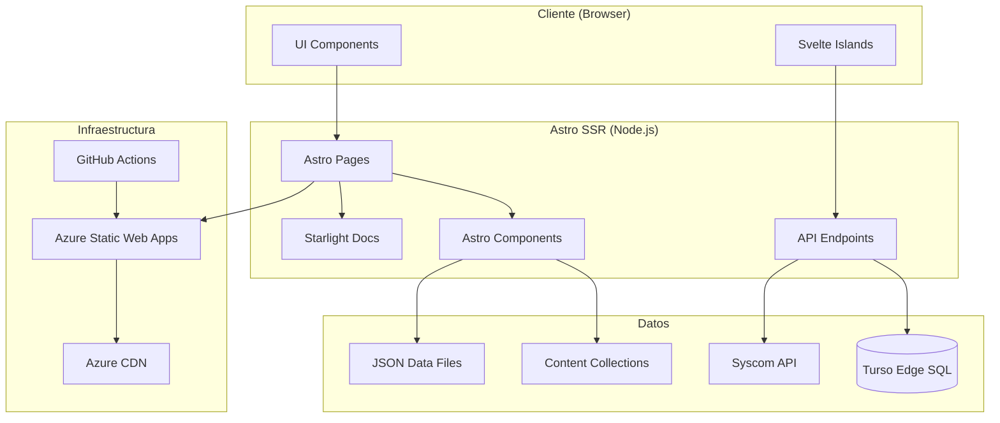
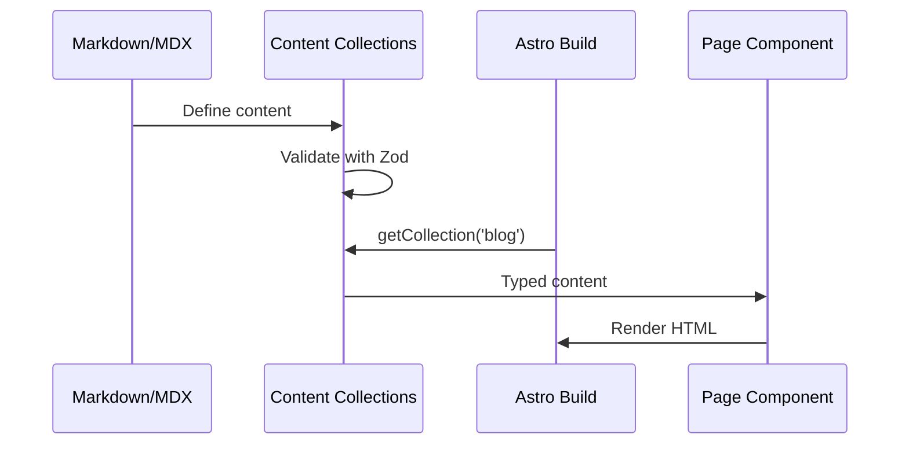
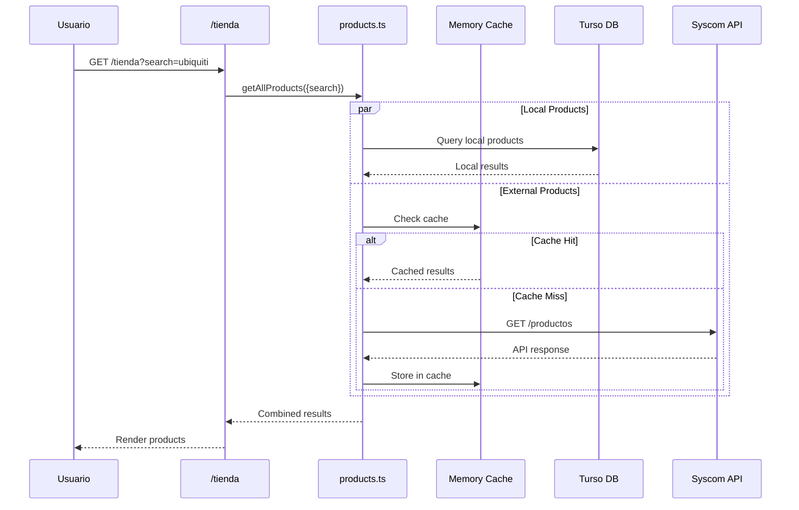
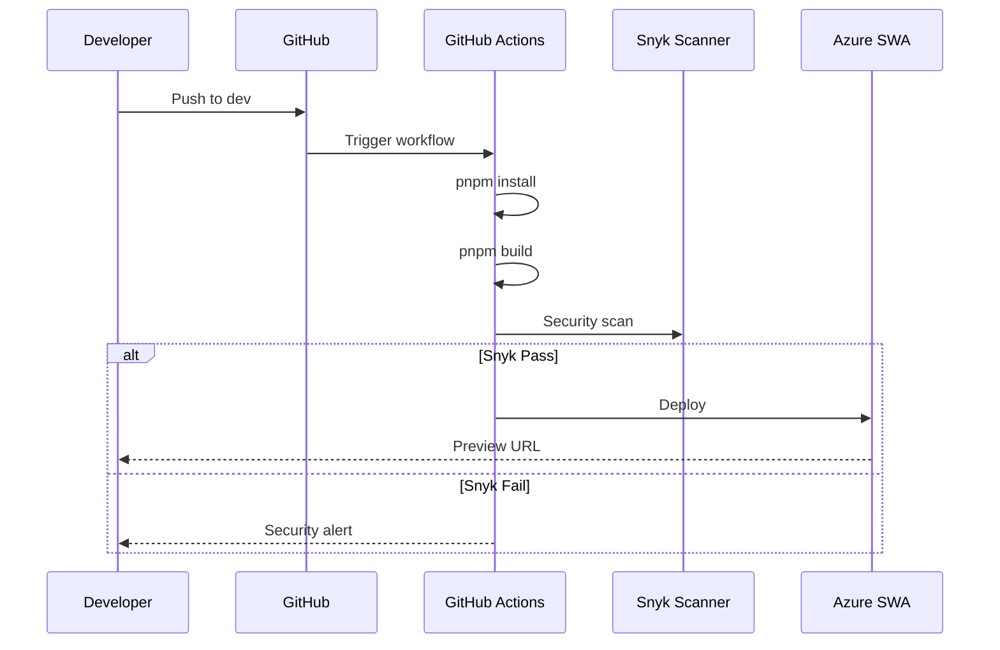

# Arquitectura del Proyecto

Este documento describe la arquitectura técnica del sitio juanoliver.net.

## Visión General



## Stack Tecnológico

| Capa | Tecnología | Versión | Propósito |
|------|------------|---------|-----------|
| **Framework** | Astro | 5.x | SSR, Islands Architecture |
| **UI Interactiva** | Svelte | 5.x | Componentes reactivos (Runes) |
| **Estilos** | Tailwind CSS | 4.x | Utility-first CSS |
| **Documentación** | Starlight | 0.37+ | Wiki técnica en /docs |
| **Base de Datos** | Turso | - | Edge SQL (SQLite) |
| **ORM** | Drizzle | - | Type-safe queries |
| **Validación** | Zod | - | Schema validation |
| **Hosting** | Azure SWA | - | Static + SSR hosting |
| **CI/CD** | GitHub Actions | - | Build, test, deploy |

## Estructura de Directorios

```
juanoliverdotnetv3/
├── .github/
│   ├── instructions/          # Instrucciones para agentes IA
│   │   ├── snyk_rules.instructions.md
│   │   ├── code_style.instructions.md
│   │   └── testing.instructions.md
│   ├── workflows/             # CI/CD pipelines
│   │   ├── ci-cd.yml
│   │   └── dependency-review.yml
│   ├── ISSUE_TEMPLATE/        # Templates de issues
│   ├── CODEOWNERS             # Propietarios de código
│   ├── dependabot.yml         # Actualizaciones automáticas
│   └── PULL_REQUEST_TEMPLATE.md
│
├── public/                    # Assets estáticos
│   └── robots.txt
│
├── src/
│   ├── assets/                # Imágenes procesadas por Astro
│   │   └── imagesblog/
│   │
│   ├── components/            # Componentes UI
│   │   ├── docs/              # Componentes Starlight personalizados
│   │   ├── home/              # Componentes de la home
│   │   ├── BlogCard.astro
│   │   ├── StoreFilters.svelte  # Svelte 5 con Runes
│   │   └── StoreList.svelte
│   │
│   ├── content/               # Contenido Markdown/MDX
│   │   ├── config.ts          # Esquemas de colecciones
│   │   ├── blog/              # Artículos del blog
│   │   └── docs/              # Documentación técnica
│   │
│   ├── data/                  # Datos estáticos y helpers
│   │   ├── navigation.ts      # Enlaces de navegación
│   │   ├── partners.ts        # Datos de socios
│   │   ├── social.ts          # Redes sociales
│   │   └── *.json             # Datos en JSON
│   │
│   ├── db/                    # Capa de base de datos
│   │   ├── client.ts          # Cliente Turso/Drizzle
│   │   ├── schema.ts          # Definición de tablas
│   │   └── seed.ts            # Script de seeding
│   │
│   ├── layouts/               # Layouts de página
│   │   └── Layout.astro
│   │
│   ├── pages/                 # Rutas de la aplicación
│   │   ├── index.astro        # Home (/)
│   │   ├── blog/              # Blog (/blog, /blog/[slug])
│   │   ├── docs.astro         # Docs index (/docs)
│   │   ├── tienda.astro       # Tienda (/tienda)
│   │   ├── socios.astro       # Socios (/socios)
│   │   ├── contacto.astro     # Contacto (/contacto)
│   │   └── 404.astro          # Error 404
│   │
│   ├── services/              # Lógica de negocio
│   │   └── products.ts        # API de productos (local + Syscom)
│   │
│   └── styles/                # Estilos globales
│       └── global.css
│
├── astro.config.mjs           # Configuración Astro
├── drizzle.config.ts          # Configuración Drizzle ORM
├── staticwebapp.config.json   # Config Azure SWA + Headers
├── tailwind.config.mjs        # Configuración Tailwind
└── tsconfig.json              # Configuración TypeScript
```

## Flujos de Datos

### 1. Contenido Estático (Blog/Docs)



### 2. Tienda (Productos Híbridos)



### 3. Build y Deploy



## Seguridad

### Headers de Seguridad (staticwebapp.config.json)

| Header | Valor | Propósito |
|--------|-------|-----------|
| Content-Security-Policy | `default-src 'self'...` | Prevenir XSS |
| Strict-Transport-Security | `max-age=31536000; includeSubDomains; preload` | Forzar HTTPS |
| X-Frame-Options | `DENY` | Prevenir clickjacking |
| X-Content-Type-Options | `nosniff` | Prevenir MIME sniffing |
| Permissions-Policy | `camera=(), microphone=()...` | Limitar APIs |

### Validación de Inputs

Todos los inputs de usuario se validan con Zod antes de procesarse:

```typescript
// Ejemplo: Formulario de contacto
const ContactSchema = z.object({
  email: z.string().email(),
  message: z.string().min(10).max(1000),
});
```

### Escaneo de Seguridad

- **Snyk Code**: SAST en cada PR
- **Snyk Open Source**: Vulnerabilidades en dependencias
- **GitHub Dependency Review**: Revisión automática de PRs

## Performance

### Optimizaciones Implementadas

1. **Islands Architecture**: Solo hidratar componentes interactivos
2. **Edge Database**: Turso para latencia mínima
3. **Caching**: Cache en memoria para API Syscom (5 min TTL)
4. **Image Optimization**: Astro Image con formatos modernos
5. **CDN**: Azure CDN para assets estáticos

### Métricas Objetivo

| Métrica | Objetivo | Herramienta |
|---------|----------|-------------|
| LCP | < 2.5s | Lighthouse |
| FID | < 100ms | Lighthouse |
| CLS | < 0.1 | Lighthouse |
| TTI | < 3.8s | Lighthouse |

## Extensibilidad

### Añadir Nueva Página

1. Crear archivo en `src/pages/`
2. Importar `Layout.astro`
3. Añadir enlace en `src/data/navigation.ts`

### Añadir Nuevo Componente

1. Crear en `src/components/`
2. Si es Svelte, usar Runes de Svelte 5
3. Documentar props con JSDoc/TypeScript

### Añadir Nueva Colección de Contenido

1. Definir schema en `src/content/config.ts`
2. Crear carpeta en `src/content/`
3. Añadir página que consume la colección
