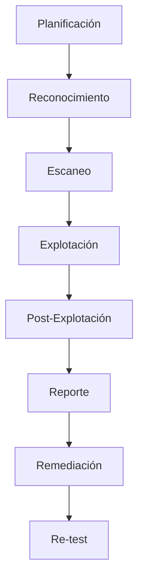

import SecurityBanner from "../../../components/docs/SecurityBanner.astro";

<SecurityBanner level="high" version="1.0" />

## ¿Qué es el Ethical Hacking?

El **Ethical Hacking** (hacking ético) es el proceso autorizado de intentar obtener acceso no autorizado a un sistema informático, aplicación o datos, utilizando las mismas técnicas que un atacante malicioso, pero con permiso expreso del propietario.

## Tipos de Pruebas de Penetración

### Según el Conocimiento

| Tipo          | Descripción                         | Uso Recomendado                      |
| ------------- | ----------------------------------- | ------------------------------------ |
| **Black Box** | Sin conocimiento previo del sistema | Simula atacante externo real         |
| **White Box** | Conocimiento completo del sistema   | Auditoría exhaustiva                 |
| **Gray Box**  | Conocimiento parcial                | Balance entre profundidad y realismo |

### Según el Objetivo

- **Web Application Pentesting** - Aplicaciones web y APIs
- **Network Pentesting** - Infraestructura de red
- **Mobile Pentesting** - Aplicaciones iOS/Android
- **Cloud Pentesting** - Infraestructura AWS/Azure/GCP
- **Social Engineering** - Factor humano

---

## Metodologías Estándar

### OWASP Testing Guide

Para aplicaciones web, seguimos la guía de pruebas OWASP que cubre:

1. **Recopilación de Información**

   - Fingerprinting de tecnologías
   - Mapeo de la aplicación
   - Identificación de puntos de entrada

2. **Pruebas de Configuración**

   - Configuración de red/infraestructura
   - Gestión de archivos y configuración
   - Gestión de extensiones

3. **Pruebas de Autenticación**

   - Bypass de autenticación
   - Políticas de contraseñas débiles
   - Gestión de sesiones

4. **Pruebas de Autorización**

   - Escalada de privilegios
   - IDOR (Insecure Direct Object Reference)
   - Path traversal

5. **Pruebas de Lógica de Negocio**
   - Validación de datos
   - Integridad de procesos
   - Límites de funcionalidad

---

## OWASP Top 10 (2024)

Las vulnerabilidades más críticas que evaluamos:

### 1. Broken Access Control

Fallas que permiten acceder a recursos no autorizados.

```text
Ejemplo: /admin/users accesible sin autenticación
```

### 2. Cryptographic Failures

Uso débil o incorrecto de criptografía.

### 3. Injection

SQL, NoSQL, OS, LDAP injection.

```sql
-- Ejemplo de SQL Injection
' OR '1'='1' --
```

### 4. Insecure Design

Fallas de diseño arquitectónico.

### 5. Security Misconfiguration

Configuraciones inseguras por defecto.

### 6. Vulnerable Components

Uso de bibliotecas con vulnerabilidades conocidas.

### 7. Authentication Failures

Fallas en identificación de usuarios.

### 8. Software and Data Integrity Failures

Falta de verificación de integridad.

### 9. Logging & Monitoring Failures

Falta de detección de ataques.

### 10. Server-Side Request Forgery (SSRF)

El servidor realiza peticiones a recursos no autorizados.

---

## Proceso de Pentesting



### 1. Planificación

- Definición de alcance
- Reglas de engagement
- Firma de acuerdos legales

### 2. Reconocimiento

- Recopilación de información pública (OSINT)
- Identificación de activos
- Mapeo de superficie de ataque

### 3. Escaneo

- Escaneo de puertos y servicios
- Identificación de vulnerabilidades
- Fingerprinting de tecnologías

### 4. Explotación

- Intento de explotación de vulnerabilidades
- Escalada de privilegios
- Movimiento lateral

### 5. Post-Explotación

- Persistencia
- Exfiltración de datos (simulada)
- Documentación de impacto

### 6. Reporte

- Hallazgos priorizados por riesgo
- Evidencias y pruebas de concepto
- Recomendaciones de remediación

---

## Herramientas Utilizadas

### Reconocimiento

- Shodan, Censys
- theHarvester
- Maltego

### Escaneo

- Nmap
- Nessus, OpenVAS
- Burp Suite, OWASP ZAP

### Explotación

- Metasploit Framework
- SQLMap
- Hydra

### Post-Explotación

- Mimikatz
- BloodHound
- Cobalt Strike

---

## Entregables

Al finalizar un engagement de pentesting, entregamos:

1. **Resumen Ejecutivo** - Para gerencia y stakeholders
2. **Reporte Técnico Detallado** - Para equipo de TI
3. **Evidencias** - Capturas, logs, pruebas de concepto
4. **Plan de Remediación** - Priorizado por riesgo
5. **Re-test** - Verificación post-remediación

---

## Solicitar Pentesting

¿Necesitas una evaluación de seguridad de tu organización? [Contáctanos](/contacto) para discutir tu proyecto.
