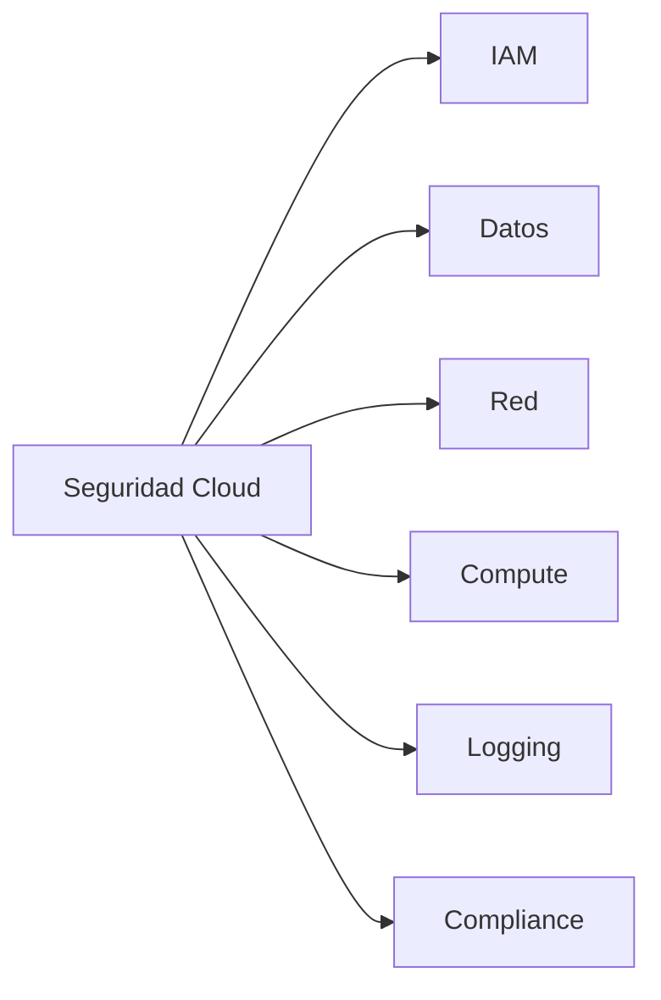

import SecurityBanner from "../../../components/docs/SecurityBanner.astro";

<SecurityBanner level="info" version="1.0" />

## Introducción a la Seguridad Cloud

La seguridad en la nube requiere un enfoque diferente al de la seguridad tradicional. Los entornos cloud operan bajo un **modelo de responsabilidad compartida** donde el proveedor protege la infraestructura y el cliente protege sus datos y configuraciones.

---

## Modelo de Responsabilidad Compartida

### IaaS (Infrastructure as a Service)

| Proveedor       | Cliente              |
| --------------- | -------------------- |
| Hardware físico | Sistemas operativos  |
| Red física      | Aplicaciones         |
| Centro de datos | Datos                |
| Hipervisor      | Identidades          |
|                 | Configuración de red |

### PaaS (Platform as a Service)

| Proveedor           | Cliente       |
| ------------------- | ------------- |
| Todo lo anterior    | Aplicaciones  |
| Sistemas operativos | Datos         |
| Runtime             | Identidades   |
|                     | Configuración |

### SaaS (Software as a Service)

| Proveedor               | Cliente                 |
| ----------------------- | ----------------------- |
| Toda la infraestructura | Datos                   |
| Aplicación              | Identidades             |
|                         | Configuración de acceso |

---

## Pilares de Seguridad Cloud



---

## 1. Gestión de Identidades (IAM)

### Principios Fundamentales

1. **Menor privilegio**

   - Solo permisos necesarios
   - Revisar periódicamente
   - Eliminar accesos no usados

2. **Separación de duties**

   - Roles diferentes para diferentes funciones
   - Aprobaciones múltiples para acciones críticas

3. **MFA obligatorio**
   - Todas las cuentas privilegiadas
   - Acceso a consola
   - APIs sensibles

### Configuración de Políticas

#### AWS IAM Policy (ejemplo)

```json
{
  "Version": "2012-10-17",
  "Statement": [
    {
      "Effect": "Allow",
      "Action": ["s3:GetObject", "s3:ListBucket"],
      "Resource": ["arn:aws:s3:::bucket-name", "arn:aws:s3:::bucket-name/*"],
      "Condition": {
        "Bool": {
          "aws:SecureTransport": "true"
        }
      }
    }
  ]
}
```

#### Azure RBAC

```json
{
  "Name": "Custom Reader",
  "Actions": [
    "Microsoft.Storage/storageAccounts/read",
    "Microsoft.Storage/storageAccounts/blobServices/containers/read"
  ],
  "NotActions": [],
  "DataActions": [
    "Microsoft.Storage/storageAccounts/blobServices/containers/blobs/read"
  ],
  "AssignableScopes": ["/subscriptions/{subscriptionId}"]
}
```

---

## 2. Protección de Datos

### Encriptación

#### En tránsito

- TLS 1.3 obligatorio
- Certificados válidos
- HTTPS everywhere

#### En reposo

- Claves gestionadas por cliente (CMK)
- Rotación automática
- HSM para claves críticas

### Clasificación de Datos

| Nivel        | Descripción     | Controles             |
| ------------ | --------------- | --------------------- |
| Público      | Sin restricción | Ninguno especial      |
| Interno      | Solo empleados  | Autenticación         |
| Confidencial | Datos sensibles | Encriptación + DLP    |
| Restringido  | PII, financiero | CMK + auditoría + MFA |

### Prevención de Pérdida (DLP)

1. **Descubrimiento**

   - Escanear almacenamiento
   - Identificar datos sensibles
   - Clasificar automáticamente

2. **Protección**
   - Políticas de acceso
   - Alertas en tiempo real
   - Bloqueo de exfiltración

---

## 3. Seguridad de Red

### Segmentación

```text
┌─────────────────────────────────────────┐
│              VPC / VNet                  │
├─────────────────────────────────────────┤
│  ┌─────────────┐  ┌─────────────┐       │
│  │   Pública   │  │   Privada   │       │
│  │   Subnet    │  │   Subnet    │       │
│  │             │  │             │       │
│  │  [ALB/WAF]  │  │  [App Tier] │       │
│  └─────────────┘  └─────────────┘       │
│                   ┌─────────────┐       │
│                   │    Data     │       │
│                   │   Subnet    │       │
│                   │  [RDS/DB]   │       │
│                   └─────────────┘       │
└─────────────────────────────────────────┘
```

### Security Groups / NSG

| Regla | Dirección | Puerto | Origen    | Destino |
| ----- | --------- | ------ | --------- | ------- |
| HTTPS | Inbound   | 443    | 0.0.0.0/0 | Web SG  |
| App   | Inbound   | 8080   | Web SG    | App SG  |
| DB    | Inbound   | 5432   | App SG    | Data SG |
| All   | Outbound  | \*     | All       | All     |

### WAF (Web Application Firewall)

Reglas esenciales:

- OWASP Core Rule Set
- Rate limiting
- Geo-blocking
- Bot protection
- SQL injection
- XSS protection

---

## 4. Seguridad de Compute

### Hardening de Instancias

1. **Imágenes base seguras**

   - CIS Benchmarks
   - Actualizaciones automáticas
   - Agentes de seguridad

2. **Configuración**

   - Deshabilitar servicios innecesarios
   - Usuarios mínimos
   - Logging habilitado

3. **Contenedores**
   - Imágenes escaneadas
   - Runtime security
   - Network policies

### Kubernetes Security

```yaml
apiVersion: v1
kind: Pod
metadata:
  name: secure-pod
spec:
  securityContext:
    runAsNonRoot: true
    runAsUser: 1000
    fsGroup: 2000
  containers:
    - name: app
      image: myapp:latest
      securityContext:
        allowPrivilegeEscalation: false
        readOnlyRootFilesystem: true
        capabilities:
          drop:
            - ALL
```

---

## 5. Logging y Monitoreo

### Logs Esenciales

| Servicio       | AWS               | Azure             | GCP                |
| -------------- | ----------------- | ----------------- | ------------------ |
| API/Management | CloudTrail        | Activity Log      | Cloud Audit        |
| Red            | VPC Flow Logs     | NSG Flow Logs     | VPC Flow Logs      |
| Storage        | S3 Access Logs    | Storage Analytics | Cloud Storage Logs |
| Compute        | EC2 Instance Logs | VM Diagnostics    | Compute Logs       |

### SIEM Integration

1. **Centralizar logs**

   - Bucket/Storage centralizado
   - Retención definida
   - Encriptación

2. **Alertas**

   - Root login
   - Cambios en IAM
   - Acceso a datos sensibles
   - Actividad inusual

3. **Dashboards**
   - Métricas de seguridad
   - Compliance status
   - Threat detection

---

## 6. Compliance y Governance

### Frameworks Soportados

- **ISO 27001** - Gestión de seguridad
- **SOC 2** - Controles de servicio
- **PCI DSS** - Datos de tarjetas
- **HIPAA** - Datos de salud
- **GDPR** - Datos personales (EU)
- **CCPA** - Datos personales (California)

### Herramientas Nativas

| Función    | AWS             | Azure              | GCP                     |
| ---------- | --------------- | ------------------ | ----------------------- |
| Posture    | Security Hub    | Defender for Cloud | Security Command Center |
| Compliance | Config          | Policy             | Asset Inventory         |
| Secrets    | Secrets Manager | Key Vault          | Secret Manager          |
| Guardrails | Control Tower   | Landing Zone       | Organization Policy     |

---

## Checklist de Seguridad Cloud

### Identidad

- [ ] MFA habilitado para todas las cuentas
- [ ] Políticas de menor privilegio
- [ ] Revisión trimestral de accesos
- [ ] Cuentas de servicio rotadas

### Red

- [ ] VPC/VNet con subnets privadas
- [ ] Security groups restrictivos
- [ ] WAF configurado
- [ ] VPN/Private Link para conectividad

### Datos

- [ ] Encriptación en tránsito (TLS 1.3)
- [ ] Encriptación en reposo (CMK)
- [ ] Backup automatizado
- [ ] Clasificación de datos

### Compute

- [ ] Imágenes hardened
- [ ] Parches automáticos
- [ ] EDR/Runtime security
- [ ] Contenedores escaneados

### Logging

- [ ] Logs centralizados
- [ ] Retención >= 1 año
- [ ] Alertas configuradas
- [ ] SIEM integrado

---

## Recursos Adicionales

- [AWS Well-Architected Security Pillar](https://docs.aws.amazon.com/wellarchitected/latest/security-pillar/)
- [Azure Security Benchmark](https://learn.microsoft.com/security/benchmark/azure/)
- [GCP Security Best Practices](https://cloud.google.com/security/best-practices)
- [CIS Benchmarks](https://www.cisecurity.org/cis-benchmarks)

---

## Auditoría de Seguridad Cloud

¿Necesitas una evaluación de seguridad de tu entorno cloud? [Contáctanos](/contacto) para una auditoría completa.
