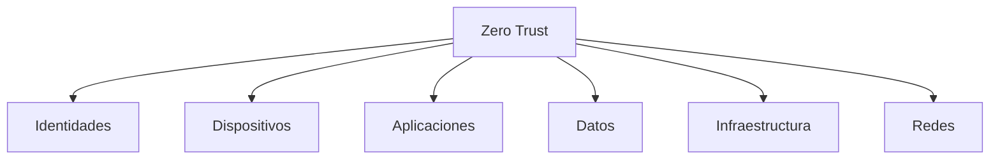

import SecurityBanner from "../../../components/docs/SecurityBanner.astro";

<SecurityBanner level="info" version="1.0" />

## ¿Qué es Zero Trust?

**Zero Trust** es un modelo de seguridad que elimina la confianza implícita y requiere verificación continua de cada usuario y dispositivo, independientemente de su ubicación dentro o fuera del perímetro de la red.

> "Never trust, always verify" - Principio fundamental de Zero Trust

---

## Principios Fundamentales

### 1. Verificar Explícitamente

Siempre autenticar y autorizar basándose en todos los puntos de datos disponibles:

- Identidad del usuario
- Ubicación
- Salud del dispositivo
- Servicio o carga de trabajo
- Clasificación de datos
- Anomalías

### 2. Usar Acceso de Menor Privilegio

Limitar el acceso del usuario con:

- Just-In-Time (JIT)
- Just-Enough-Access (JEA)
- Políticas adaptativas basadas en riesgo
- Protección de datos

### 3. Asumir Breach

Minimizar el radio de explosión y acceso segmentando:

- Por red
- Por usuario
- Por dispositivos
- Por aplicaciones

---

## Pilares de Zero Trust



### Identidades

- Autenticación multifactor (MFA)
- Single Sign-On (SSO)
- Gestión de identidades privilegiadas (PIM)
- Acceso condicional

### Dispositivos

- Inventario de dispositivos
- Gestión de dispositivos móviles (MDM)
- Endpoint Detection and Response (EDR)
- Evaluación de cumplimiento

### Aplicaciones

- Descubrimiento de shadow IT
- Gestión de acceso a aplicaciones
- Monitoreo en tiempo real
- Controles en línea

### Datos

- Clasificación de datos
- Etiquetado y encriptación
- Prevención de pérdida de datos (DLP)
- Gestión de derechos

### Infraestructura

- Gestión de configuración
- Just-In-Time access
- Monitoreo de anomalías
- Defensa en profundidad

### Redes

- Micro-segmentación
- Encriptación extremo a extremo
- Detección de amenazas
- Software-defined perimeter

---

## Modelo de Madurez

| Nivel           | Característica      | Descripción                               |
| --------------- | ------------------- | ----------------------------------------- |
| **Tradicional** | Perímetro           | Confianza basada en ubicación de red      |
| **Inicial**     | Identidad           | MFA implementado, SSO parcial             |
| **Avanzado**    | Dispositivo + App   | Políticas por dispositivo y aplicación    |
| **Óptimo**      | Zero Trust completo | Verificación continua, micro-segmentación |

---

## Implementación Práctica

### Fase 1: Identidades (0-3 meses)

1. **Implementar MFA**

   ```text
   Prioridad: Crítica
   Usuarios: Todos
   Métodos: Authenticator app, FIDO2, SMS (fallback)
   ```

2. **Configurar SSO**

   - Integrar todas las aplicaciones corporativas
   - Eliminar contraseñas locales

3. **Acceso Condicional**
   - Bloquear países no autorizados
   - Requerir dispositivos compliance
   - Detectar sign-ins riesgosos

### Fase 2: Dispositivos (3-6 meses)

1. **Inventario completo**

   - Todos los endpoints corporativos
   - Dispositivos BYOD

2. **MDM/MAM**

   - Políticas de cumplimiento
   - Borrado remoto
   - Encriptación obligatoria

3. **EDR**
   - Detección de amenazas
   - Respuesta automatizada
   - Hunting proactivo

### Fase 3: Aplicaciones y Datos (6-12 meses)

1. **Clasificación de datos**

   - Sensibilidad
   - Regulación
   - Valor de negocio

2. **DLP**

   - Políticas por clasificación
   - Alertas en tiempo real
   - Bloqueo de exfiltración

3. **CASB**
   - Visibilidad de shadow IT
   - Control de acceso
   - Protección de datos

### Fase 4: Red e Infraestructura (12+ meses)

1. **Micro-segmentación**

   - Aislar cargas de trabajo
   - Políticas por aplicación
   - Zero lateral movement

2. **SASE/ZTNA**
   - Reemplazar VPN tradicional
   - Acceso por aplicación
   - Inspección de tráfico

---

## Tecnologías Clave

### Microsoft Entra ID (Azure AD)

- Conditional Access
- Privileged Identity Management
- Identity Protection

### Microsoft Defender for Endpoint

- EDR
- Attack Surface Reduction
- Automated Investigation

### Azure Network Security

- Azure Firewall
- Network Security Groups
- Private Link

---

## Métricas de Éxito

| Métrica                    | Objetivo   |
| -------------------------- | ---------- |
| % usuarios con MFA         | 100%       |
| % apps con SSO             | 95%+       |
| Tiempo de detección (MTTD) | < 24 horas |
| Tiempo de respuesta (MTTR) | < 4 horas  |
| Dispositivos compliance    | 98%+       |

---

## Recursos Adicionales

- [NIST SP 800-207](https://csrc.nist.gov/publications/detail/sp/800-207/final) - Zero Trust Architecture
- [CISA Zero Trust Maturity Model](https://www.cisa.gov/zero-trust-maturity-model)
- [Microsoft Zero Trust deployment guide](https://learn.microsoft.com/security/zero-trust/)

---

## Solicitar Consultoría

¿Necesitas ayuda implementando Zero Trust en tu organización? [Contáctanos](/contacto) para una evaluación inicial.
